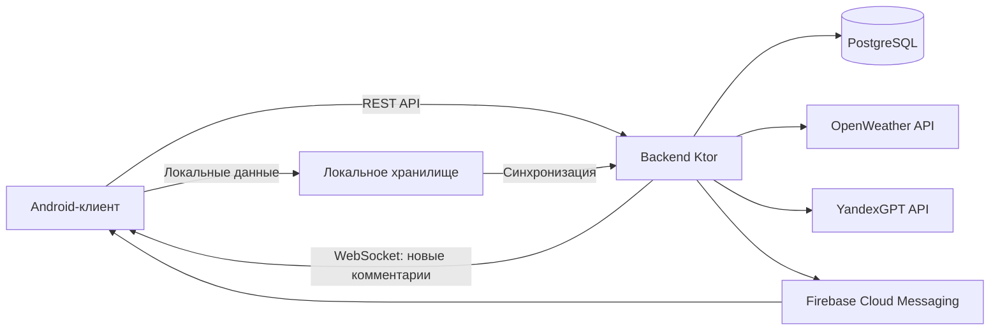
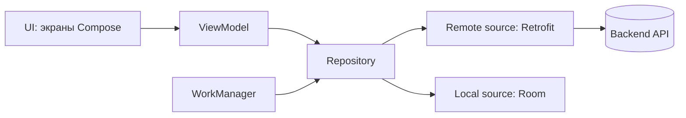
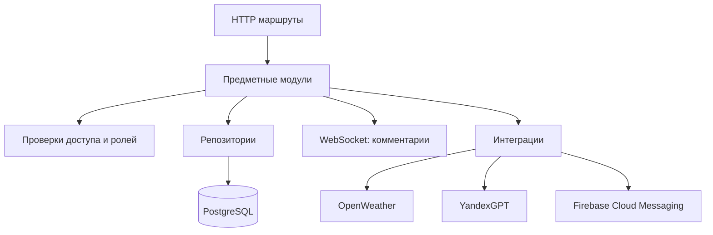
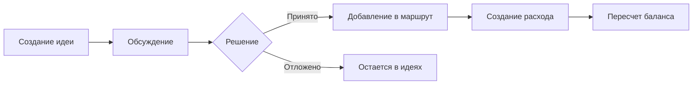

# Презентация ВКР: готовый контент для переноса в PowerPoint

Формат каждого блока:
- `Содержание слайда` — то, что переносится на слайд;
- `Текст доклада` — готовый текст, который можно читать на защите.

Ориентир по длительности: 8–10 минут.

---

## Слайд 1. Титульный
### Содержание слайда
- Тема: «Андроид-приложение для совместного планирования поездок».
- Новик Илья Иванович, БПИ223.
- Научный руководитель: Брейман Александр Давидович.
- НИУ ВШЭ, ФКН, 2026.

### Текст доклада
Добрый день, уважаемые члены комиссии. Меня зовут Новик Илья Иванович, группа БПИ223. Тема моей выпускной квалификационной работы — «Андроид-приложение для совместного планирования поездок». Работа выполнена под руководством Бреймана Александра Давидовича. В докладе я покажу предметную область, анализ аналогов, архитектурные решения, реализованный функционал, результаты проверки и план доработок.

---

## Слайд 2. Основные термины
### Содержание слайда
- Поездка — общий контекст данных: участники, даты, идеи, маршрут, расходы.
- Владелец / участник — роли доступа: владелец управляет поездкой, участник работает в ее рамках.
- Идея / комментарий — предложение активности и обсуждение решения по нему.
- Активность маршрута — элемент плана конкретного дня поездки.
- Расход / баланс — запись траты и итог взаиморасчетов между участниками.
- Офлайн-контур — обработка действий при нестабильной сети с последующей синхронизацией.

### Текст доклада
Перед переходом к архитектуре зафиксирую термины. Центральная сущность — поездка: в ее контексте выполняются все действия. Владелец управляет доступом к поездке, участник выполняет рабочие операции в рамках своей роли. Идеи и комментарии покрывают этап обсуждения, активности — этап маршрутного планирования. Расходы и баланс покрывают финансовый контур. Отдельно выделяется офлайн-контур, который важен для мобильного сценария при нестабильной сети.

---

## Слайд 3. Предметная область и проблема
### Содержание слайда
- Предметная область: совместное планирование групповой поездки.
- Ключевые этапы процесса: идеи -> обсуждение -> маршрут -> расходы -> согласование итогового плана.
- Проблема: данные и решения распределены между несколькими сервисами.
- Последствия: потеря контекста, дублирование действий, рост координационных ошибок.

### Текст доклада
Предметная область работы — совместное планирование групповой поездки, то есть процесс от появления идеи до согласованного плана и прозрачного учета расходов. Основная проблема здесь — фрагментация: обсуждение, маршрут и финансы обычно живут в разных инструментах. В результате появляются несколько версий плана, часть решений теряется, а организатор вручную сводит данные между сервисами. Целевая гипотеза проекта: единое приложение снижает координационные издержки и делает процесс предсказуемым.

---

## Слайд 4. Анализ существующих решений
### Содержание слайда
Таблица сравнения по критериям:

| Сервис | Совместное планирование в одном пространстве | Идеи и обсуждения | Маршрут по дням | Расходы и баланс | Погода | AI-подсказки | Приглашения / совместный доступ |
|---|---|---|---|---|---|---|---|
| Splitwise | - | - | - | + | - | - | + |
| Wanderlog | - | - | + | - | - | - | + |
| TravelSpend | - | - | - | + | - | - | - |
| TripIt | - | - | + | - | - | - | - |
| Яндекс Путешествия | - | - | - | - | - | - | + |
| RUSSPASS | - | - | - | - | - | - | - |
| Разрабатываемое приложение | + | + | + | + | + | + | + |

Примечание: оценка бинарная; если функция закрывает критерий только фрагментарно, ставится `-`.

Вывод:
- аналоги сильны в отдельных подзадачах;
- сквозной сценарий в едином рабочем контуре закрыт неполно;
- это и определяет нишу разрабатываемого решения.

### Текст доклада
На этапе анализа были рассмотрены шесть популярных решений. Сравнение проведено по критериям, напрямую связанным с целевой задачей моей работы. Видно, что у каждого аналога есть сильная сторона, но они закрывают преимущественно отдельные сегменты, а не весь сквозной сценарий совместного планирования. Именно этот функциональный разрыв и определяет нишу разрабатываемого приложения.

---

## Слайд 5. Цель и задачи ВКР
### Содержание слайда
Цель работы:
- разработка и реализация мобильного приложения для совместного планирования поездок.

Задачи:
1. Проанализировать предметную область и ограничения фрагментированного подхода.
2. Рассмотреть существующие решения и их функциональные границы.
3. Сформулировать функциональный разрыв и целевую нишу приложения.
4. Спроектировать архитектуру системы, модель данных и ключевые пользовательские сценарии.
5. Обосновать выбор методов и средств реализации.
6. Разработать серверную часть (API, правила доступа, хранение данных).
7. Разработать клиентскую часть Android-приложения.
8. Провести проверку сквозных пользовательских сценариев.

### Текст доклада
Цель работы — разработать и реализовать мобильное приложение для совместного планирования поездок. Для достижения этой цели были решены восемь задач: от аналитики предметной области и аналогов до проектирования архитектуры, реализации backend и Android-клиента, а также проверки сквозных пользовательских сценариев.

---

## Слайд 6. Обзорная архитектура системы
### Содержание слайда

### Текст доклада
Система построена по клиент-серверной архитектуре. Android-клиент отвечает за интерфейс и пользовательские сценарии. Сервер на Ktor централизует бизнес-правила, ролевые проверки и доступ к данным. Основное хранение — PostgreSQL. Внешние интеграции — погодный API, AI-провайдер и Firebase Cloud Messaging для уведомлений. Для событий новых комментариев используется WebSocket, для остальных операций — REST API.

---

## Слайд 7. Архитектура клиентской части
### Содержание слайда
- Подход: `UI -> ViewModel -> Repository -> Data source`.
- Основные паттерны: MVVM, Repository, Dependency Injection.
- Инструменты: Jetpack Compose, Hilt, Retrofit/OkHttp, Room.
- Фоновая обработка и синхронизация: WorkManager.

Краткая роль слоев:
1. UI — экраны и навигация.
2. ViewModel — состояние и обработка событий.
3. Repository — единая точка доступа к сети и локальным данным.
4. Data source — API-клиенты и локальное хранилище.

### Текст доклада
Клиентская архитектура построена на MVVM с Repository и DI. Такое разделение дает предсказуемое состояние экранов, снижает связанность между UI и сетью, и упрощает сопровождение. В качестве технологической базы используются Compose, Hilt и Retrofit, а локальные данные хранятся в Room. Для фоновой обработки задач синхронизации используется WorkManager.

---

## Слайд 8. Архитектура серверной части
### Содержание слайда
- Платформа: Kotlin + Ktor.
- Модульность: `auth`, `trip`, `idea`, `itinerary`, `expense`, `invite`, `notification`, `sync`.
- Структура обработки: маршрут -> предметный модуль -> репозиторий.
- Принципы:
  - сервер — единый источник истинного состояния;
  - проверки ролей и прав выполняются на сервере;
  - интеграции вынесены в отдельные адаптеры.

### Текст доклада
Серверная часть реализована как модульный backend на Kotlin/Ktor. Маршруты сгруппированы по предметным областям, а правила валидации и доступа сосредоточены в серверных модулях. Это уменьшает риск расхождений между API-сценариями и упрощает развитие системы. Интеграции с погодой, AI и уведомлениями изолированы от ядра предметной логики.

---

## Слайд 9. Ключевой пользовательский поток
### Содержание слайда

### Текст доклада
Ключевая ценность приложения — сквозной поток от идеи к исполнимому плану и финансовому результату. Участники обсуждают предложения, переводят принятые решения в маршрут, затем фиксируют расходы и получают обновленный баланс. Пользователь не теряет контекст между этапами и не переключается между разными сервисами.

---

## Слайд 10. Клиент-серверное взаимодействие
### Содержание слайда
- REST API (JSON) — операции по поездкам, идеям, маршруту, расходам, приглашениям, настройкам.
- WebSocket — события новых комментариев.
- Уведомления — Firebase Cloud Messaging.
- Контроль доступа:
  - только участники поездки работают с ее данными;
  - операции владельца и участника разграничены по ролям.

### Текст доклада
Основной обмен идет через REST API в формате JSON. Для новых комментариев используется WebSocket-канал, чтобы обсуждение обновлялось без ручного рефреша. События для фоновых оповещений передаются через Firebase Cloud Messaging. Ключевой момент: контроль доступа всегда остается на сервере, включая проверку участия в поездке и ролевые ограничения.

---

## Слайд 11. Интеграции: погода, AI, уведомления
### Содержание слайда
| Интеграция | Назначение | Результат для пользователя |
|---|---|---|
| OpenWeather API | Погодный контекст поездки | Более обоснованный выбор активностей по дням |
| YandexGPT API | Генерация идей по параметрам поездки | Ускорение наполнения плана |
| Firebase Cloud Messaging | Push-уведомления по событиям поездки | Меньше пропущенных изменений в совместной работе |

### Текст доклада
В проекте реализованы три интеграционных контура. Погода помогает планировать активности с учетом внешних условий. AI-модуль ускоряет генерацию вариантов и может сразу сохранять их как идеи. Подсистема уведомлений на базе Firebase Cloud Messaging снижает риск пропуска значимых событий в совместной поездке.

---

## Слайд 12. Функциональные требования (сводно)
### Содержание слайда
1. Авторизация, профиль, выход, удаление аккаунта.
2. Поездки и участники: создание, редактирование, удаление, приглашения, присоединение.
3. Идеи и обсуждения: создание идей, комментарии, модерация статуса.
4. Маршрут: планирование активностей по дням, перенос между днями.
5. Расходы и баланс: фиксация трат, доли участников, итоговый баланс.
6. Внешний контекст: погода, AI-предложения, уведомления.

### Текст доклада
Функциональные требования сформированы вокруг полного пользовательского контура совместного планирования. Важно, что требования покрывают не отдельные экраны, а связанный сценарий: от создания поездки и принятия решений до маршрутной и финансовой фиксации результата.

---

## Слайд 13. Выбор технологий и обоснование
### Содержание слайда
| Критерий | Выбранное решение | Обоснование |
|---|---|---|
| Клиентская платформа | Kotlin + Android | Нативная поддержка Android и предсказуемое сопровождение |
| UI-слой | Jetpack Compose | Быстрая итерация интерфейса и единый декларативный подход |
| Архитектура клиента | MVVM + Repository + Hilt | Управляемое состояние, тестируемость, модульность |
| Сервер | Kotlin + Ktor | Единый язык со стеком клиента и простая модульная архитектура |
| Хранилище | PostgreSQL | Надежная реляционная модель для связных данных поездки |
| Уведомления | Firebase Cloud Messaging | Стандартный канал push для Android |

### Текст доклада
Выбор технологий выполнен по критериям совместимости, управляемости и стоимости сопровождения. На клиенте используется нативный Android-стек с декларативным UI и DI. На сервере выбран модульный Ktor backend. Для уведомлений используется Firebase Cloud Messaging, что дает устойчивый и распространенный механизм доставки push-событий.

---

## Слайд 14. Что реализовано на текущей контрольной точке
### Содержание слайда
- Реализован основной онлайн-контур приложения:
  - авторизация и профиль;
  - поездки и участники;
  - идеи, обсуждения, маршрут;
  - расходы и баланс;
  - погода, AI, уведомления через Firebase.
- Текущий статус: выполнено около 90% общего объема работ.

### Текст доклада
На текущей контрольной точке реализован основной пользовательский контур приложения. Пользователь может пройти весь ключевой онлайн-сценарий совместного планирования: от создания поездки до формирования маршрута и учета расходов. Дополнительно работают внешние интеграции и уведомления. В сумме это около 90% общего объема работ.

---

## Слайд 15. Проверка сквозных сценариев
### Содержание слайда
| Сценарий | Что проверялось | Результат |
|---|---|---|
| Поездка + приглашение | Общий доступ владельца и участника | Пройден |
| Идея -> обсуждение -> маршрут | Перенос решения в план дня | Пройден |
| Расходы и баланс | Пересчет долей и итогов | Пройден |
| Погода + AI | Генерация и сохранение предложений | Пройден |
| Уведомления | Применение выбранных категорий | Пройден |

### Текст доклада
Проверка выполнялась по сквозным пользовательским сценариям. Все контрольные сценарии основного контура воспроизводятся без критических отклонений. Это подтверждает работоспособность системы в целевом формате совместного планирования поездки.

---

## Слайд 16. Что осталось: офлайн и мелкие доработки
### Содержание слайда
Остаток работ:
1. Доведение офлайн-контуров синхронизации.
2. Точечные продуктовые и инженерные багфиксы.
3. Расширение регрессионных проверок граничных случаев.

### Текст доклада
Оставшаяся часть работ сфокусирована на двух направлениях: доведение офлайн-поведения и закрытие мелких багов. То есть ключевой контур уже работает, а следующий этап направлен на повышение устойчивости и качества пользовательского опыта.

---

## Слайд 17. Практическая значимость
### Содержание слайда
- Получен не прототип, а рабочий клиент-серверный продукт.
- В одном приложении объединены ключевые этапы группового планирования.
- Снижены потери контекста между обсуждением, маршрутом и расходами.
- Архитектура позволяет эволюционно развивать проект без переработки основы.

### Текст доклада
Практическая значимость работы в том, что получен интегрированный продукт с рабочим пользовательским контуром, а не изолированный демонстрационный экран. Пользователь получает единое пространство для планирования, а архитектура проекта остается расширяемой для следующих итераций.

---

## Слайд 18. Заключение
### Содержание слайда
- Цель на текущей контрольной точке достигнута.
- Основной функциональный контур реализован и проверен.
- Выполнено около 90% работ.
- Следующий этап: офлайн и точечные доработки.

### Текст доклада
Таким образом, на текущей контрольной точке цель работы достигнута: реализован и проверен основной контур Android-приложения для совместного планирования поездок с backend-частью и интеграциями. Фактически выполнено около 90% работ. Оставшийся этап — доведение офлайн-контуров и закрытие точечных багов.

---

## Слайд 19. План демонстрации
### Содержание слайда
Порядок демо:
1. Вход и список поездок.
2. Создание поездки и приглашение участника.
3. Добавление идеи и обсуждение.
4. Перенос идеи в маршрут.
5. Добавление расхода и пересчет баланса.
6. Погода, AI-предложение, уведомления.

### Текст доклада
В демонстрации я покажу последовательный пользовательский путь: от входа и создания поездки до маршрута, расходов и внешних интеграций. Это позволит наглядно показать связность модулей и практическую применимость решения.

---

## Слайд 20. Список использованных источников
### Содержание слайда
1. Splitwise. URL: https://www.splitwise.com/  
2. Wanderlog. URL: https://wanderlog.com/  
3. TravelSpend. URL: https://travel-spend.com/  
4. TripIt. URL: https://www.tripit.com/  
5. Яндекс Путешествия (новость 03.04.2025). URL: https://yandex.ru/company/news/01-03-04-2025  
6. PostgreSQL Documentation. URL: https://www.postgresql.org/docs/  
7. Ktor Documentation. URL: https://ktor.io/docs/welcome.html  
8. Android Jetpack Compose. URL: https://developer.android.com/compose  
9. Dependency Injection with Hilt. URL: https://developer.android.com/training/dependency-injection/hilt-android  
10. Retrofit. URL: https://square.github.io/retrofit/  
11. OpenWeather API. URL: https://openweathermap.org/api  
12. YandexGPT (Foundation Models). URL: https://yandex.cloud/en/docs/ai-studio/concepts/generation/models  
13. Firebase Cloud Messaging. URL: https://firebase.google.com/docs/cloud-messaging

### Текст доклада
На слайде представлен сокращенный список ключевых источников, использованных при анализе аналогов, проектировании архитектуры и реализации технологического стека.

---

## Слайд 21. Спасибо за внимание
### Содержание слайда
- Спасибо за внимание.
- Готов ответить на вопросы.

### Текст доклада
Спасибо за внимание. Готов ответить на вопросы по архитектурным решениям, проверке сценариев и плану закрытия оставшихся задач.
