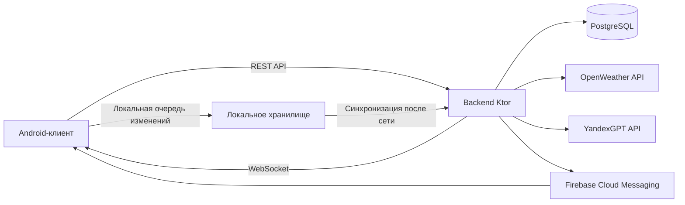
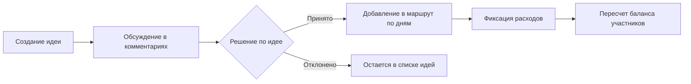

# Текст к слайдам презентации ВКР

Документ подготовлен как готовый сценарий выступления. Формат каждого блока:
- что разместить на слайде;
- полный текст, который можно читать на защите.

Ориентир по длительности: 8-10 минут.

---

## Слайд 1. Титульный
### Что на слайде
- Тема: «Андроид-приложение для совместного планирования поездок».
- ФИО, группа, руководитель.

### Текст выступления
Добрый день, уважаемые члены комиссии. Меня зовут Новик Илья Иванович, группа БПИ223. Тема моей выпускной квалификационной работы — «Андроид-приложение для совместного планирования поездок». Работа выполнена под руководством Бреймана Александра Давидовича. В докладе я кратко покажу предметную область, обоснование архитектурных решений, реализованный функционал, результаты проверки и план доработок.

---

## Слайд 2. Основные термины
### Что на слайде
- Поездка.
- Владелец и участник.
- Идея и комментарий.
- Активность маршрута.
- Расход и баланс.
- Офлайн-очередь.

### Текст выступления
Перед переходом к архитектуре зафиксирую ключевые термины. Поездка — это центральная сущность, в контексте которой выполняются все действия. Владелец создает поездку и управляет доступом, участник работает с содержимым поездки в рамках своей роли. Идея — это предложение активности до включения в маршрут. Активность — элемент маршрута на конкретный день. Расход и баланс отражают финансовую часть поездки. Офлайн-очередь — это локально сохраненные изменения, которые отправляются на сервер после восстановления сети.

---

## Слайд 3. Предметная область и проблема
### Что на слайде
- Фрагментация инструментов: чат, карты, заметки, финансы.
- Потеря контекста и дублирование данных.
- Рост координационных ошибок в группе.

### Текст выступления
В предметной области ключевая проблема — фрагментация. Обычно идеи обсуждаются в одном сервисе, маршрут ведется в другом, расходы — в третьем. В результате группа получает несколько версий плана, а организатор вручную синхронизирует данные. Это повышает вероятность ошибок и усложняет коллективное принятие решений. Целевая гипотеза проекта — объединение сценариев в одном мобильном приложении снижает координационные издержки и делает процесс планирования предсказуемым.

---

## Слайд 4. Анализ существующих решений
### Что на слайде
- Splitwise, Wanderlog, TravelSpend, TripIt, Яндекс Путешествия, RUSSPASS.
- Таблица сравнения по критериям:
  - совместное пространство;
  - идеи и обсуждения;
  - маршрут;
  - расходы и баланс;
  - погодный контекст;
  - AI-подсказки;
  - приглашения.

### Текст выступления
На этапе анализа были рассмотрены популярные решения. Вывод следующий: каждое из них закрывает отдельный сегмент задачи, но не весь сквозной пользовательский поток. Например, одни продукты сильны в финансах, другие — в маршруте или контенте. В рамках выбранных критериев не найдено решения, которое одновременно поддерживает идеи с обсуждением, перенос решений в маршрут, расходы с балансом и совместный доступ в едином рабочем контуре.

---

## Слайд 5. Цель и задачи ВКР
### Что на слайде
- Цель работы.
- 8 задач из введения ВКР.

### Текст выступления
Цель моей работы — разработка и реализация мобильного приложения для совместного планирования поездок. Для достижения цели решены восемь задач: анализ предметной области, анализ аналогов, формулирование функционального разрыва, проектирование архитектуры и модели данных, обоснование выбранных средств, разработка backend-части, разработка Android-клиента и проверка сквозных пользовательских сценариев.

---

## Слайд 6. Обзорная архитектура системы
### Что на слайде
- Схема взаимодействия клиента, backend, базы данных и внешних сервисов.

### Текст выступления
Система реализована в клиент-серверной архитектуре. Android-клиент отвечает за интерфейс, локальное состояние и пользовательские сценарии. Backend на Ktor централизует бизнес-правила, проверку ролей и доступ к данным. Данные хранятся в PostgreSQL. Внешние интеграции — это погодный API, AI-провайдер и Firebase Cloud Messaging для push-уведомлений. Для обсуждений используется WebSocket-канал, а для остальных операций — REST API. Такой подход дает единый источник истины на сервере и устойчивость клиентского контура при нестабильной сети.

---

## Слайд 7. Архитектура клиентской части
### Что на слайде
- Выбранный подход: MVVM + Repository + DI.
- Цепочка: UI -> ViewModel -> Repository -> Data source.
- WorkManager для фоновой синхронизации.

### Текст выступления
Для клиента выбран подход MVVM в связке с Repository и DI. ViewModel управляет состоянием экранов через потоки состояния, поэтому поведение интерфейса остается предсказуемым. Repository скрывает детали источников данных: сеть, локальное хранилище и очередь синхронизации. DI через Hilt упрощает модульность и тестирование. Для фоновых задач применяется WorkManager, который отвечает за отложенную отправку изменений и восстановление согласованного состояния после появления сети.

---

## Слайд 8. Архитектура серверной части
### Что на слайде
- Kotlin + Ktor.
- Паттерн: маршрут -> предметный модуль -> репозиторий.
- Разделение модулей: auth, trips, ideas, itinerary, expenses, notifications, sync.

### Текст выступления
На сервере выбран модульный backend на Kotlin и Ktor. Архитектурный паттерн — маршрут, затем предметный модуль, затем репозиторий доступа к данным. Это позволяет держать валидацию, проверки ролей и правила доступа в единых точках. В результате снижается риск расхождений между разными API-сценариями и упрощается сопровождение при расширении функционала.

---

## Слайд 9. Ключевой пользовательский поток
### Что на слайде
- Схема «идея -> обсуждение -> маршрут -> расходы».

### Текст выступления
Ключевая ценность приложения — сквозной пользовательский поток. Участник создает идею, группа обсуждает ее, затем идея переносится в маршрут или остается на доработку. После включения активностей в план фиксируются расходы, и система пересчитывает баланс участников. За счет такого контура пользователь не теряет контекст между обсуждением, планом и финансовой частью.

---

## Слайд 10. Клиент-серверное взаимодействие
### Что на слайде
- REST API для CRUD-операций.
- WebSocket для событий по новым комментариям.
- JSON как формат обмена.

### Текст выступления
Основной обмен построен на REST API с JSON. Для дискуссий добавлен событийный канал через WebSocket, чтобы новые комментарии поступали без ручного обновления экрана. При этом контроль прав всегда выполняется на сервере: пользователь может работать только в тех поездках, участником которых он является.

---

## Слайд 11. Интеграции: погода, AI, уведомления
### Что на слайде
- Погода: контекст для планирования активностей.
- AI: генерация предложений и сохранение в идеи.
- Уведомления через Firebase Cloud Messaging: события по идеям и расходам.

### Текст выступления
В работе реализованы три интеграционных контура. Погода дополняет планирование контекстом поездки. AI-модуль генерирует варианты активностей и позволяет сохранить результат как идею. Подсистема уведомлений построена на Firebase Cloud Messaging: клиент регистрирует FCM-токен, сервер отправляет push-события по идеям и расходам. Эти модули не заменяют ядро приложения, а усиливают сценарий принятия решений.

---

## Слайд 12. Функциональные требования к программе
### Что на слайде
- Авторизация и профиль пользователя.
- Управление поездками и участниками.
- Идеи, обсуждения и перенос в маршрут.
- Маршрут по дням.
- Расходы, доли и баланс.
- Погодный контекст, AI-подсказки, уведомления.

### Текст выступления
Функциональные требования сформированы вокруг пользовательского процесса. Пользователь должен иметь возможность авторизоваться, создать поездку, пригласить участников, обсудить идеи, перенести выбранные активности в маршрут и контролировать общие расходы с прозрачным балансом. Дополнительно система предоставляет погодный контекст, AI-подсказки и уведомления о значимых событиях. Таким образом, требования покрывают полный цикл совместного планирования, а не отдельные изолированные функции.

---

## Слайд 13. Технологии и инструменты реализации
### Что на слайде
- Android: Kotlin, Jetpack Compose, Hilt, Retrofit/OkHttp.
- Backend: Kotlin, Ktor, PostgreSQL.
- Инфраструктура: WorkManager, WebSocket, Firebase Cloud Messaging.
- Интеграции: OpenWeather API, YandexGPT API.
- Инженерный контур: Gradle, GitHub, quality-check.

### Текст выступления
Технологический стек выбран по критериям совместимости, скорости разработки и предсказуемости сопровождения. На клиенте используются Kotlin, Compose, Hilt и Retrofit. На сервере — Kotlin и Ktor, хранилище — PostgreSQL. Для устойчивости мобильного сценария применяются WorkManager и офлайн-очередь, для дискуссий — WebSocket, для push-уведомлений — Firebase Cloud Messaging, для интеграций — OpenWeather и YandexGPT. Качество контролируется через единый сценарий проверок и автоматизированные тестовые прогоны.

---

## Слайд 14. Что реализовано в текущей версии
### Что на слайде
- Авторизация и профиль.
- Поездки и участники.
- Идеи, обсуждения, маршрут.
- Расходы и баланс.
- Погода, AI, уведомления через Firebase.
- Основной пользовательский контур завершен (около 90% объема работы).

### Текст выступления
В текущей версии реализованы все ключевые подсистемы основного пользовательского контура: авторизация и профиль, управление поездкой и участниками, идеи с обсуждениями, маршрут по дням, расходы с балансом, а также погодные и AI-функции и контур уведомлений на базе Firebase. На этой контрольной точке объем выполненной работы составляет около 90%.

---

## Слайд 15. Проверка сквозных сценариев
### Что на слайде
- Сценарий 1: поездка + приглашение участника.
- Сценарий 2: идея -> обсуждение -> маршрут.
- Сценарий 3: расходы и баланс.
- Сценарий 4: погода + AI.
- Сценарий 5: уведомления.

### Текст выступления
Проверка проведена по сквозным пользовательским сценариям. В рамках контрольного набора сценарии воспроизводятся: общая поездка отображается у владельца и участника, идеи переходят в маршрут, баланс пересчитывается по расходам, интеграционные модули работают при доступности внешних сервисов, а уведомления применяются в рамках поддерживаемых категорий.

---

## Слайд 16. Что осталось: офлайн и точечные доработки
### Что на слайде
- Доведение офлайн-контуров.
- Мелкие продуктовые и инженерные фиксы.

### Текст выступления
Оставшиеся задачи зафиксированы как следующий этап. В остатке два блока: доведение офлайн-поведения приложения и мелкие продуктовые/инженерные фиксы. По офлайну нужно закрыть оставшиеся ветки синхронизации, а по качеству — доработать точечные UX-детали и регрессионные проверки граничных случаев.

---

## Слайд 17. Результаты и практическая значимость
### Что на слайде
- Реализован целостный клиент-серверный продукт.
- Подтвержден сквозной сценарий совместного планирования.
- Сформирован понятный план развития.

### Текст выступления
Практический результат ВКР — не отдельный прототип экрана, а интегрированный продукт с рабочим пользовательским контуром совместного планирования поездок. По итогам проверки подтверждено соответствие целевым сценариям текущей версии. Кроме того, сформирован конкретный план развития, сфокусированный на расширении офлайн-возможностей и дальнейшем повышении устойчивости.

---

## Слайд 18. Заключение
### Что на слайде
- Краткий итог по цели и выполненным задачам.

### Текст выступления
Таким образом, цель работы на текущей контрольной точке достигнута: разработано и реализовано Android-приложение для совместного планирования поездок с backend-частью и интеграциями, закрывающее основной пользовательский контур. Фактически выполнено около 90% объема работ; в остатке — офлайн-блок и мелкие фиксы. Работа может быть продолжена эволюционно без пересборки архитектуры, за счет уже принятых модульных решений.

---

## Слайд 19. Демонстрация
### Что на слайде
- План демо: поездка -> идея -> маршрут -> расход -> итог.

### Текст выступления
В демонстрации я последовательно покажу: создание поездки, приглашение участника, добавление идеи и обсуждение, перенос активности в маршрут, фиксацию расхода и пересчет баланса. Это отражает основной пользовательский поток, на который ориентирована архитектура приложения.

---

## Слайд 20. Список использованных источников
### Что на слайде
- Сокращенный список ключевых источников.

### Текст выступления
При подготовке работы и реализации решения использованы открытые источники по аналогам, технологическому стеку и документации платформ, а также проектная документация разработки.

### Список источников (для слайда/раздатки)
1. Splitwise. URL: https://www.splitwise.com/ (дата обращения: 15.03.2026).
2. Wanderlog. URL: https://wanderlog.com/ (дата обращения: 15.03.2026).
3. TravelSpend. URL: https://travel-spend.com/ (дата обращения: 15.03.2026).
4. TripIt. URL: https://www.tripit.com/ (дата обращения: 15.03.2026).
5. Яндекс. «Яндекс Путешествия упростили совместные поездки», 03.04.2025. URL: https://yandex.ru/company/news/01-03-04-2025 (дата обращения: 15.03.2026).
6. RUSSPASS (Google Play). URL: https://play.google.com/store/apps/details?id=ru.russpass.tourist (дата обращения: 15.03.2026).
7. PostgreSQL Documentation. URL: https://www.postgresql.org/docs/ (дата обращения: 15.03.2026).
8. Ktor Documentation. URL: https://ktor.io/docs/welcome.html (дата обращения: 15.03.2026).
9. Kotlin Documentation. URL: https://kotlinlang.org/docs/home.html (дата обращения: 15.03.2026).
10. Android Jetpack Compose. URL: https://developer.android.com/compose (дата обращения: 15.03.2026).
11. Dependency Injection with Hilt. URL: https://developer.android.com/training/dependency-injection/hilt-android (дата обращения: 15.03.2026).
12. Retrofit. URL: https://square.github.io/retrofit/ (дата обращения: 15.03.2026).
13. OpenWeather API. URL: https://openweathermap.org/api (дата обращения: 15.03.2026).
14. YandexGPT (Foundation Models). URL: https://yandex.cloud/en/docs/ai-studio/concepts/generation/models (дата обращения: 15.03.2026).
15. WorkManager. URL: https://developer.android.com/topic/libraries/architecture/workmanager (дата обращения: 15.03.2026).
16. Firebase Cloud Messaging. URL: https://firebase.google.com/docs/cloud-messaging (дата обращения: 20.03.2026).
17. Firebase Admin SDK Documentation. URL: https://firebase.google.com/docs/admin/setup (дата обращения: 20.03.2026).
18. Android Distribute to Google Play. URL: https://developer.android.com/distribute/google-play (дата обращения: 15.03.2026).
19. Техническое задание.
20. Программа и методика испытаний.
21. Текст программы.

---

## Слайд 21. Спасибо за внимание
### Что на слайде
- «Спасибо за внимание».
- Контакты.

### Текст выступления
Спасибо за внимание. Готов ответить на вопросы по архитектуре, проверке сценариев, ограничениям текущей версии и плану дальнейших доработок.
