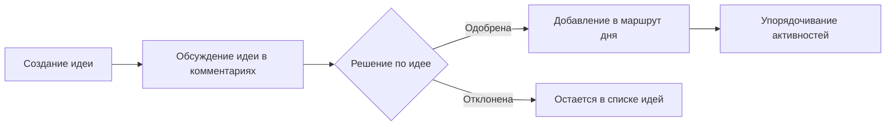
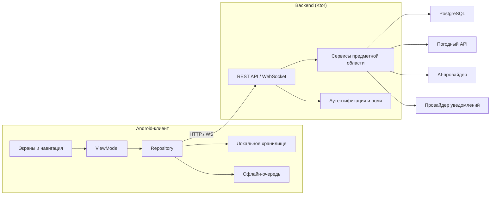
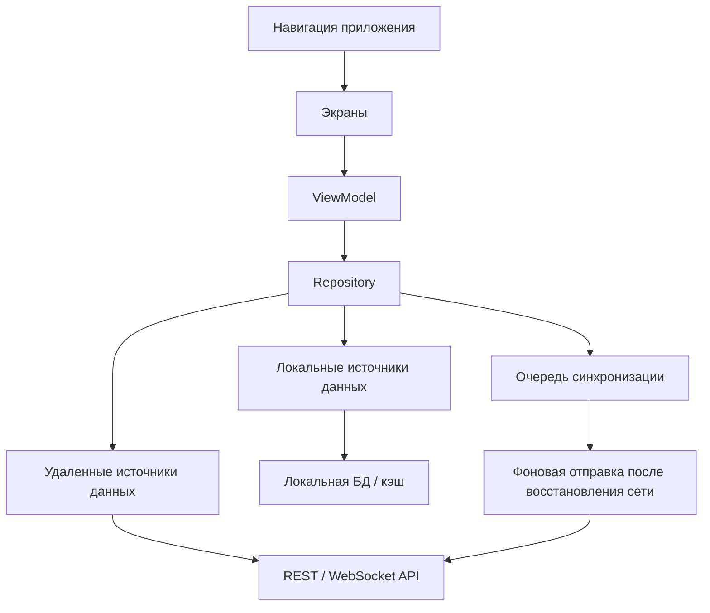
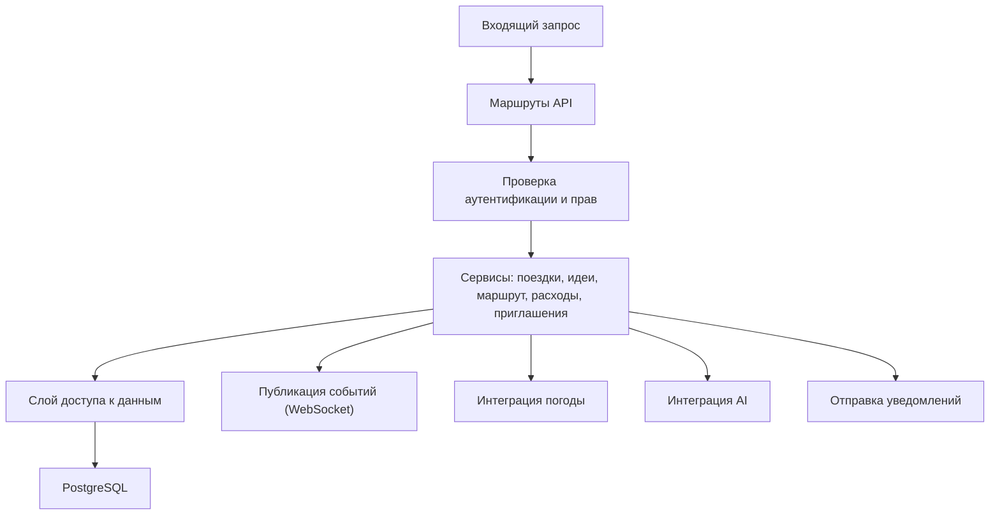
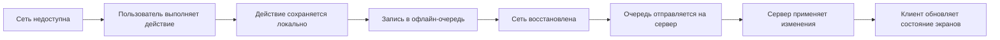

# Mermaid-схемы для ВКР (раздел 2)

## Что добавить в ВКР
1. Обязательно: схема 2.1 (пользовательский поток идея -> обсуждение -> маршрут).
2. Обязательно: схема 2.2 (обзорная архитектура системы).
3. Обязательно: схема 2.3 (офлайн-режим и синхронизация).
4. Дополнительно к 2.2 (рекомендуется): отдельная схема архитектуры клиента.
5. Дополнительно к 2.2 (рекомендуется): отдельная схема архитектуры бэкенда.

## Схема 2.1. Пользовательский поток

## Схема 2.2. Обзорная архитектура системы

## Схема 2.2a. Архитектура клиента (рекомендуемая дополнительная)

## Схема 2.2b. Архитектура бэкенда (рекомендуемая дополнительная)

## Схема 2.3. Офлайн-режим и синхронизация

