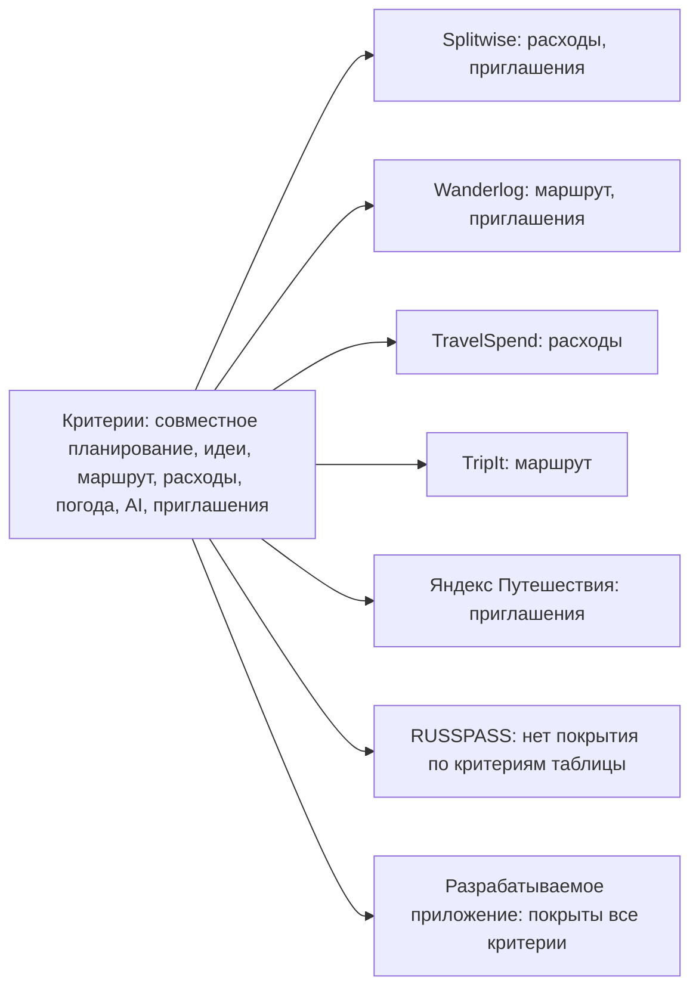
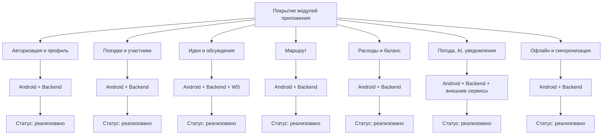
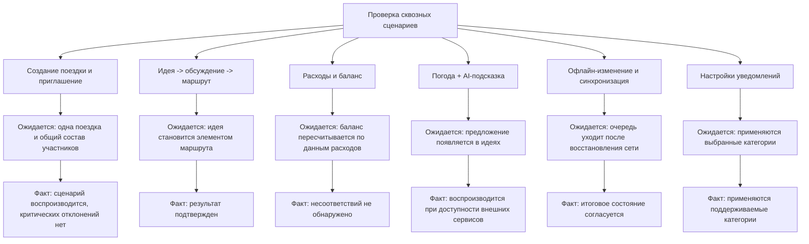
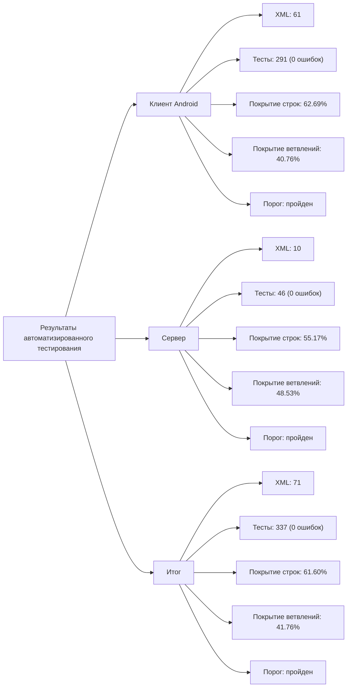

# Mermaid для таблиц ВКР

Ниже — Mermaid-представления всех таблиц из ВКР.

## Таблица 1. Сравнение существующих решений и разрабатываемого приложения

## Таблица 2. Ключевые пользовательские сценарии и риски

```mermaid
flowchart TD
  T2["Ключевые сценарии и риски"]

  A["Создание поездки и приглашение участника"]
  A1["Компоненты: Android клиент, API поездок, API приглашений"]
  A2["Результат: общая рабочая область"]
  A3["Риск: невалидная/устаревшая ссылка"]

  B["Идея -> обсуждение -> маршрут"]
  B1["Компоненты: идеи, комментарии real-time, маршрут"]
  B2["Результат: идея фиксируется в плане дня"]
  B3["Риск: конкурирующие изменения статуса"]

  D["Добавление расхода и пересчет баланса"]
  D1["Компоненты: расходы, участники, расчет по API"]
  D2["Результат: актуальные доли и баланс"]
  D3["Риск: ошибки входных данных расхода"]

  E["Погода и AI-предложение"]
  E1["Компоненты: погодный модуль, AI-модуль, идеи"]
  E2["Результат: контекст и сохранение предложения в идеи"]
  E3["Риск: частичная недоступность внешних сервисов"]

  F["Работа без сети и синхронизация"]
  F1["Компоненты: локальное хранилище, очередь, API синхронизации"]
  F2["Результат: локальная фиксация и отправка после восстановления сети"]
  F3["Риск: коллизии при одновременных изменениях"]

  T2 --> A --> A1
  A --> A2
  A --> A3

  T2 --> B --> B1
  B --> B2
  B --> B3

  T2 --> D --> D1
  D --> D2
  D --> D3

  T2 --> E --> E1
  E --> E2
  E --> E3

  T2 --> F --> F1
  F --> F2
  F --> F3
```

## Таблица 3. Подсистемы приложения и их назначение

```mermaid
flowchart TD
  T3["Подсистемы приложения"]

  P1["Авторизация и профиль"] --> P1F["Функции: вход, профиль, выход, удаление аккаунта"]
  P1 --> P1V["Ценность: контролируемый доступ"]
  P1 --> P1R["Ограничение: зависимость от внешней аутентификации"]

  P2["Поездки и участники"] --> P2F["Функции: CRUD поездки, участники, приглашения"]
  P2 --> P2V["Ценность: единое совместное пространство"]
  P2 --> P2R["Ограничение: валидация дат и приглашений"]

  P3["Идеи и обсуждения"] --> P3F["Функции: идеи, комментарии, модерация статуса"]
  P3 --> P3V["Ценность: прозрачная фиксация решений"]
  P3 --> P3R["Ограничение: ролевые ограничения владельца/участника"]

  P4["Маршрут по дням"] --> P4F["Функции: добавление, перенос, упорядочивание"]
  P4 --> P4V["Ценность: исполнимый план поездки"]
  P4 --> P4R["Ограничение: действия в диапазоне дат"]

  P5["Расходы и баланс"] --> P5F["Функции: расходы, сплиты, статусы оплаты"]
  P5 --> P5V["Ценность: финансовая прозрачность"]
  P5 --> P5R["Ограничение: валидность сумм/участников/валюты"]

  P6["Погода и AI-подсказки"] --> P6F["Функции: прогноз, генерация, сохранение предложений"]
  P6 --> P6V["Ценность: поддержка принятия решений"]
  P6 --> P6R["Ограничение: зависимость от внешних API"]

  P7["Настройки уведомлений"] --> P7F["Функции: переключение категорий уведомлений"]
  P7 --> P7V["Ценность: меньше пропущенных событий"]
  P7 --> P7R["Ограничение: платформа доставки уведомлений"]

  P8["Офлайн и синхронизация"] --> P8F["Функции: локальная запись и отложенная отправка"]
  P8 --> P8V["Ценность: непрерывность работы без сети"]
  P8 --> P8R["Ограничение: конфликтные изменения при синхронизации"]

  T3 --> P1
  T3 --> P2
  T3 --> P3
  T3 --> P4
  T3 --> P5
  T3 --> P6
  T3 --> P7
  T3 --> P8
```

## Таблица 4. Покрытие модулей приложения

## Таблица 5. Проверка сквозных пользовательских сценариев

## Таблица 6. Результаты автоматизированного тестирования и покрытия

