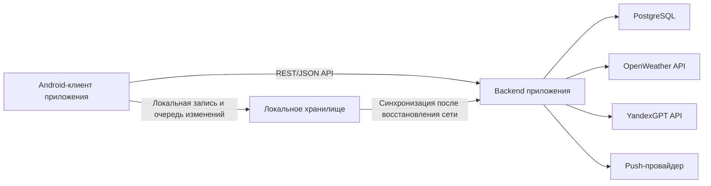

# Андроид-приложение для совместного планирования поездок
## Android Application for Collaborative Trip Planning

## Реферат
Выпускная квалификационная работа посвящена разработке Android-приложения для совместного планирования поездок. Актуальность исследования обусловлена тем, что в реальной практике групповой подготовки поездки пользователи распределяют задачи между несколькими сервисами, что приводит к дублированию данных и потере контекста решений.

Объектом исследования является процесс совместного планирования поездок в малых группах пользователей. Предметом исследования выступают пользовательские сценарии, функциональные требования и проектные решения мобильного приложения, объединяющего ключевые этапы планирования в едином цифровом пространстве.

Цель работы состоит в проектировании и реализации мобильного приложения, обеспечивающего целостный сценарий группового планирования поездки. В рамках работы проведен анализ предметной области и существующих решений, сформулирован функциональный разрыв, разработаны архитектурные и модульные решения, а также описана программная реализация подсистем приложения.

Результатом работы является структурированная модель приложения, включающая управление поездками и участниками, работу с идеями и маршрутом, учет расходов и балансов, погодный контекст, AI-предложения, настройки уведомлений, а также офлайн-режим с последующей синхронизацией данных.

Практическая значимость работы заключается в применимости полученного результата для повседневного группового планирования поездок и в возможности дальнейшего развития системы в эксплуатационном контуре.

Ключевые слова: Android-приложение, совместное планирование поездок, маршрут по дням, учет расходов, баланс участников, офлайн-синхронизация, AI-предложения.

## Abstract
This graduation thesis is focused on developing an Android application for collaborative trip planning. The study is relevant because in real group planning practice users typically split their work across multiple digital services, which causes data duplication and loss of decision context.

The object of the study is the collaborative trip planning process in small user groups. The subject of the study is user scenarios, functional requirements, and design decisions for a mobile application that combines key planning stages within a single digital workspace.

The goal of the thesis is to design and implement a mobile application that supports an end-to-end group trip planning workflow. The work includes domain analysis and review of existing solutions, identification of a functional gap, development of architectural and modular solutions, and description of software implementation.

The resulting artifact is a structured application model that covers trip and participant management, ideas and itinerary planning, expense tracking and balance calculation, weather context, AI-based suggestions, notification settings, and offline mode with subsequent synchronization.

The practical significance lies in the applicability of the proposed solution to everyday collaborative trip planning and in its readiness for further system evolution in an operational environment.

Keywords: Android application, collaborative trip planning, day-by-day itinerary, expense tracking, participant balance, offline synchronization, AI suggestions.

## Основные определения, термины и сокращения
- **Поездка** — сущность планирования, объединяющая даты, участников, идеи, маршрут и расходы.
- **Участник** — пользователь, присоединенный к поездке и участвующий в совместных действиях.
- **Владелец** — пользователь, который создал поездку и управляет доступом и модерацией.
- **Идея** — пользовательское предложение активности или места до включения в маршрут.
- **Активность** — элемент маршрута, назначенный на конкретный день поездки.
- **Расход** — запись о планируемой или уже произведенной трате в рамках поездки.
- **Баланс** — агрегированное представление финансовых обязательств участников поездки.
- **Офлайн-синхронизация** — механизм локального сохранения действий при отсутствии сети с последующей отправкой изменений на сервер.
- **AI-предложение** — автоматически сгенерированная рекомендация, которую пользователь может сохранить в список идей.

## Введение
Планирование групповых поездок в повседневной практике чаще всего выполняется в нескольких цифровых каналах одновременно: обсуждения ведутся в мессенджерах, маршрут фиксируется в картографических сервисах, расходы учитываются в отдельных приложениях, а погодные данные и справочная информация ищутся во внешних источниках. Такая фрагментация приводит к дублированию действий, потере контекста принятых решений и повышенной координационной нагрузке на организатора поездки [8].

Актуальность темы обусловлена потребностью в едином мобильном инструменте, который поддерживает полный цикл совместного планирования: от формулирования идей и обсуждений до формирования маршрута по дням и прозрачного учета расходов. Для малых групп пользователей критична не только доступность отдельных функций, но и их согласованная работа в общем сценарии [7][8].

Объектом исследования является процесс совместного планирования поездок в малых группах.

Предметом исследования являются пользовательские сценарии, функциональные требования и проектные решения мобильного приложения, обеспечивающего совместную работу участников поездки в едином информационном пространстве.

Цель выпускной квалификационной работы - разработка и реализация мобильного приложения, предназначенного для совместного планирования поездок и снижения издержек групповой координации.

Для достижения поставленной цели решаются следующие задачи:
1. Проанализировать предметную область и выявить ограничения фрагментированного подхода к планированию поездок.
2. Рассмотреть существующие решения и определить их функциональные границы в контексте совместного планирования.
3. Сформулировать функциональный разрыв и обосновать целевую нишу разрабатываемого приложения.
4. Спроектировать архитектуру системы, модель данных и ключевые пользовательские сценарии.
5. Обосновать выбор методов и средств реализации.
6. Подготовить основу для программной реализации и последующей проверки сквозных сценариев.

Практическая значимость работы состоит в создании прикладного Android-приложения, в котором объединены пользовательски значимые функции: управление поездкой, совместный доступ, работа с идеями и маршрутом, учет расходов и балансов, погодный контекст, AI-предложения, уведомления и поддержка офлайн-работы с последующей синхронизацией [7][9].

Выпускная квалификационная работа включает три главы. В первой главе рассматриваются предметная область и существующие решения, во второй - проектирование системы, в третьей - программная реализация и результаты проверки сквозных пользовательских сценариев.

# Глава 1. Предметная область и существующие решения

## 1.1 Предметная область и актуальность
Совместное планирование поездки представляет собой последовательность взаимосвязанных действий: выбор направления и дат, формирование списка активностей, обсуждение альтернатив, распределение расходов и согласование итогового маршрута. На каждом этапе участники принимают коллективные решения, которые влияют на дальнейшие шаги. Изменение одного параметра поездки, например даты или состава участников, затрагивает сразу несколько подсистем планирования.

Ключевая проблема предметной области заключается в разрыве контекста между инструментами, когда обсуждения, маршрут и расходы фиксируются в разных сервисах. В результате участники получают несколько версий одного и того же плана, а владелец поездки вынужден вручную синхронизировать информацию. Это увеличивает вероятность ошибок, усложняет контроль договоренностей и снижает прозрачность процесса [8].

Таким образом, актуальной является задача создания единого мобильного пространства, в котором данные поездки связаны на уровне пользовательского сценария, а переход между этапами планирования выполняется без потери контекста [7][8][9].

## 1.2 Описание существующих решений
Для анализа использованы решения, представленные в проектном предложении, а также их публичные описания [8]. Рассматриваемые сервисы закрывают отдельные аспекты группового планирования и позволяют определить функциональные границы существующих подходов.

### 1.2.1 Splitwise
Splitwise ориентирован на учет совместных расходов и расчет взаиморасчетов между участниками группы [1]. Сервис предоставляет удобные механизмы фиксации трат и контроля задолженности, однако не покрывает задачи обсуждения идей и формирования маршрутного плана по дням в рамках единого процесса [1][8].

### 1.2.2 Wanderlog
Wanderlog предназначен для планирования поездок и совместного редактирования маршрута [2]. Сильной стороной решения является маршрутная часть, однако в контексте целевой постановки разрабатываемого приложения финансовые и дискуссионные сценарии представлены ограниченно и не формируют целостный контур принятия решений [2][8].

### 1.2.3 TravelSpend
TravelSpend специализируется на фиксации расходов во время поездки [3]. Продукт эффективен для финансового учета, но не позиционируется как единая среда, объединяющая идеи, обсуждения, маршрут и совместное управление доступом [3][8].

### 1.2.4 TripIt
TripIt решает задачу агрегации информации о поездке и автоматизации отдельных организационных операций [4]. При этом сервис не ориентирован на полноценную коллективную модерацию идей и их управляемый перенос в маршрут в рамках одного пользовательского пространства [4][8].

### 1.2.5 Яндекс Путешествия
В публикации от 3 апреля 2025 года для сервиса «Яндекс Путешествия» описан режим совместной поездки по ссылке-приглашению [5]. Данный функционал улучшает совместный доступ к информации, однако основной акцент сервиса остается на сценариях подбора и бронирования, а не на полном цикле группового планирования с интегрированным учетом обсуждений и расходов [5][8].

### 1.2.6 RUSSPASS
RUSSPASS ориентирован на подбор маршрутов и туристический контент [6]. По открытым описаниям сервис поддерживает информационный и навигационный контур путешествия, но не заявляет полный набор механизмов коллективного планирования, включая управляемые обсуждения и баланс расходов в рамках одной рабочей области [6][8].

Проведенный обзор показывает, что существующие продукты преимущественно специализируются на отдельных задачах. Наиболее частый подход - закрытие одного функционального сегмента (маршрут, расходы или контент), а не сквозного сценария совместной подготовки поездки.

## 1.3 Описание разрабатываемого решения
Разрабатываемое решение направлено на объединение ключевых пользовательских действий в рамках одной поездки как центральной сущности. Функциональная модель сервиса включает:
1. Авторизацию и персональный профиль пользователя.
2. Создание и управление поездками с параметрами дат, валюты и состава участников.
3. Механизм приглашений для совместного доступа.
4. Подсистему идей и обсуждений с ролями владельца и участника.
5. Маршрут по дням с операциями добавления, переноса и переупорядочивания активностей.
6. Учет расходов с балансом и статусами оплаты.
7. Погодный модуль по контексту поездки.
8. AI-подсказки с сохранением предложения в список идей.
9. Настройки уведомлений и поддержку офлайн-работы с последующей синхронизацией [7][9].

С точки зрения пользовательского результата разрабатываемое приложение формирует единую рабочую область, в которой обсуждение и фиксация решений не разрываются между внешними сервисами. Это позволяет уменьшить количество повторных действий и повысить прозрачность группового планирования [7][8].

## 1.4 Сравнительный анализ существующих решений
Для сопоставления решений использована матрица критериев, непосредственно связанных с целевой задачей разрабатываемого приложения.

| Сервис | Совместное планирование в одном пространстве | Идеи и обсуждения | Маршрут по дням | Расходы и баланс | Погода | AI-подсказки | Приглашения / совместный доступ |
|---|---|---|---|---|---|---|---|
| Splitwise | Нет | Нет | Нет | Да | Нет | Нет | Да |
| Wanderlog | Частично | Частично | Да | Частично | Частично | Нет | Да |
| TravelSpend | Нет | Нет | Нет | Да | Нет | Нет | Частично |
| TripIt | Частично | Нет | Да | Нет | Частично | Нет | Частично |
| Яндекс Путешествия | Частично | Нет | Частично | Нет | Частично | Частично | Да |
| RUSSPASS | Частично | Нет | Частично | Нет | Частично | Нет | Частично |
| Разрабатываемое приложение | Да | Да | Да | Да | Да | Да | Да |

Результаты сравнительного анализа показывают, что у рассмотренных решений присутствуют сильные стороны в отдельных функциональных доменах, однако в рамках выбранных критериев и источников [1][2][3][4][5][6] не прослеживается целостное покрытие сквозного сценария «идея -> обсуждение -> маршрут -> расходы -> синхронизация» в одном пользовательском пространстве [8].

## 1.5 Функциональный разрыв и обоснование ниши разрабатываемого приложения
По итогам анализа можно выделить функциональный разрыв, релевантный предметной области совместного планирования поездок:
1. Отсутствие единого пространства, где одновременно поддерживаются обсуждение идей, маршрутное планирование и финансовая прозрачность.
2. Недостаточная связность между этапами принятия решения и фактическим включением активности в маршрут.
3. Ограниченная поддержка коллективной работы при изменениях данных и нестабильном подключении.

Позиционирование разрабатываемого приложения определяется как интегрированный мобильный сервис для небольших групп пользователей, которым необходима единая среда принятия и фиксации решений по поездке. В отличие от специализированных решений, приложение ориентировано на целостный процесс, где каждая подсистема работает в контексте одной поездки и общей ролевой модели [7][8][9].

## 1.6 Выводы по главе
В первой главе рассмотрена предметная область совместного планирования поездок и обоснована актуальность ее цифровой интеграции. Проведен обзор существующих решений, показавший, что распространенные сервисы закрывают отдельные подзадачи, но в рамках принятых критериев сравнения не демонстрируют целостного сквозного сценария коллективной подготовки поездки.

На основе сравнительного анализа сформулирован функциональный разрыв и определено позиционирование разрабатываемого приложения как решения, объединяющего в едином пользовательском контуре управление поездкой, обсуждение идей, маршрут, расходы и вспомогательные сервисы. Полученные результаты задают основу для второй главы, в которой рассматриваются проектные решения и архитектура системы.

# Глава 2. Проектирование системы

## 2.1 Пользовательские сценарии
Проектирование системы опирается на ролевую модель «владелец поездки - участник поездки» и на сквозные сценарии, формирующие целевую пользовательскую ценность. Владелец инициирует поездку и управляет доступом, участники участвуют в обсуждениях, планировании маршрута и распределении расходов.

Ключевые сценарии, учитываемые при проектировании, представлены в таблице.

| Сценарий | Компоненты | Результат | Риски |
|---|---|---|---|
| Создание поездки и приглашение участника | Клиент Android, API поездок, API приглашений | Формируется общая рабочая область поездки для владельца и участника | Невалидная или устаревшая ссылка приглашения |
| Идея -> обсуждение -> маршрут | Подсистема идей, комментарии real-time, модуль маршрута | Предложение участника после обсуждения фиксируется в плане дня | Конкурирующие изменения статуса идеи |
| Добавление расхода и пересчет баланса | Подсистема расходов, участники поездки, клиентский расчет итогов по данным API | Пользователи видят актуальные доли и итоговый баланс | Ошибки входных данных расхода |
| Погода и AI-предложение | Погодный модуль, AI-модуль, подсистема идей | Пользователь получает контекст и сохраняет предложение в идеи | Частичная недоступность внешних сервисов |
| Работа без сети и синхронизация | Локальное хранилище, очередь изменений, API синхронизации | Операции создания, изменения и удаления фиксируются локально и отправляются после восстановления сети | Коллизии при одновременных изменениях |

Для демонстрации связности модулей в главе 2 используется базовый поток «идея -> обсуждение -> маршрут», поскольку именно он отражает переход от коллективного обсуждения к формальному плану поездки.

**[МЕСТО ДЛЯ РИСУНКА 2.2: ключевой пользовательский поток "идея -> обсуждение -> маршрут" (вставляется вручную)]**

## 2.2 Архитектура системы
Система проектируется как клиент-серверное приложение. Клиентская часть реализует пользовательские экраны, локальное хранение и оркестрацию сценариев. Серверная часть централизует бизнес-правила, доступ к данным и интеграцию с внешними сервисами. Такой подход поддерживает единый источник актуального состояния поездки при сохранении отзывчивости интерфейса [12][13][14].

**[МЕСТО ДЛЯ РИСУНКА 2.1: обзорная архитектура системы (экспорт схемы/скрин архитектурной диаграммы) (вставляется вручную)]**

Архитектурная схема фиксирует два уровня согласования данных: оперативный (онлайн-взаимодействие через API и каналы обновлений) и отложенный (офлайн-изменения с последующей синхронизацией). Такое разделение необходимо для мобильного сценария, в котором состояние сети не гарантировано [19].

## 2.3 Модель данных и связи сущностей
Концептуальная модель данных строится вокруг сущности поездки как корневого объекта. Все функциональные подсистемы связаны с поездкой и наследуют ее контекст (даты, участники, ограничения, валюту).

Основные связи сущностей описываются следующим образом:
1. Пользователь может участвовать в нескольких поездках, а одна поездка содержит нескольких участников.
2. Идея принадлежит конкретной поездке и может быть преобразована в активность маршрута.
3. Комментарии являются элементами обсуждения идеи и связаны с автором.
4. Маршрут представлен набором дней, каждый день содержит упорядоченный список активностей.
5. Расход относится к поездке и включает распределение долей между выбранными участниками.
6. Погодные данные привязываются к выбранному городу и датам поездки.
7. Предложение AI создается в контексте поездки и может быть сохранено как идея.

Для серверного хранения применяется реляционная модель данных на основе PostgreSQL. В текущей реализации структура таблиц инициализируется схемой проекта и поддерживается в кодовой базе. На стороне клиента сохраняется локальное состояние, необходимое для восстановления пользовательского процесса при временной потере сети [10][11][19].

## 2.4 Подсистемы и функциональное назначение
Для проектирования и последующей реализации выделены функциональные подсистемы, каждая из которых решает отдельную задачу, но работает в рамках общего сценария поездки.

| Подсистема | Функции | Пользовательская ценность | Ограничения |
|---|---|---|---|
| Авторизация и профиль | Вход, управление профилем, выход, удаление аккаунта | Контролируемый доступ к персональным данным | Зависимость от доступности внешней аутентификации |
| Поездки и участники | Создание/редактирование поездки, управление участниками, приглашения | Быстрое формирование совместного пространства | Валидация дат и проверка корректности приглашений |
| Идеи и обсуждения | Создание идей, комментарии, модерация статуса | Прозрачная фиксация коллективных решений | Ролевые ограничения операций владельца/участника |
| Маршрут по дням | Добавление, перенос и упорядочивание активностей | Формирование исполнимого плана поездки | Ограничение действиями в диапазоне дат поездки |
| Расходы и баланс | Добавление расходов, сплиты, контроль статусов оплаты | Прозрачность финансовой ответственности | Валидность сумм, состава участников и валюты |
| Погода и AI-подсказки | Прогноз по городу поездки, генерация и сохранение предложений | Поддержка принятия решений по активности | Зависимость от внешних API и качества входного контекста |
| Настройки уведомлений | Управление категориями уведомлений | Снижение риска пропуска важных изменений | Ограничения платформенной доставки push |
| Офлайн и синхронизация | Локальная запись, отложенная отправка операций создания/изменения/удаления | Непрерывность работы при нестабильной сети | Конфликтные изменения при поздней синхронизации |

Представленная декомпозиция соответствует требованиям ТЗ и задает основу для модульной реализации, где пользователь наблюдает целостный процесс, а не набор изолированных экранов [7].

## 2.5 Выбор методов и средств реализации
Выбор методов и средств реализации выполнен с учетом требований к мобильности, расширяемости и согласованной работе нескольких подсистем.

### 2.5.1 Серверная часть
Серверная часть ориентирована на централизованную реализацию доменных правил и внешних интеграций. В качестве технологической основы используются Kotlin и Ktor, что позволяет строить API-контур для работы с поездками, участниками, идеями, маршрутом и расходами [12][13].

### 2.5.2 Хранилище данных
Для транзакционного хранения доменных сущностей используется PostgreSQL. Структура базы данных определяется инициализационной схемой проекта, что обеспечивает воспроизводимое развертывание в рамках текущего контура разработки [10][11].

### 2.5.3 Клиентская часть
Мобильный клиент реализуется для платформы Android. Для построения интерфейсов и пользовательских потоков используется современный стек Android-разработки, включая декларативный UI и типовые механизмы сетевого взаимодействия [14][15][16].

### 2.5.4 Интеграционные компоненты
Для расширения пользовательского контура в проекте используются внешние сервисы прогноза погоды и AI-генерации. В подсистеме офлайн-работы применяется механизм фоновой обработки задач синхронизации. Такой выбор позволяет сохранить работоспособность ключевых сценариев даже при частичной недоступности внешних источников [17][18][19].

## 2.6 Нефункциональные решения
Нефункциональные решения сформулированы с позиции эксплуатационной устойчивости и качества пользовательского опыта.

1. **Согласованность данных.** Для поддерживаемых операций серверный контур задает единые правила валидации и хранения, чтобы участники поездки получали согласованное состояние после синхронизации изменений [12][13].
2. **Надежность пользовательских сценариев.** Критические действия (идеи, маршрут, расходы) проектируются с учетом обработки ошибок и восстановления после сетевых сбоев [7][19].
3. **Безопасность доступа.** Доступ к данным поездки ограничен аутентификацией и участием пользователя в поездке; ролевые операции владельца и участника разграничены в сценариях модерации и управления доступом [7][12].
4. **Интеграционная устойчивость.** При недоступности отдельных внешних сервисов базовые функции совместного планирования остаются доступными, а вспомогательные данные обновляются после восстановления интеграций [17][18].
5. **Эксплуатационная применимость.** Архитектура допускает развертывание серверной части в облачном контуре и публикацию мобильного клиента в стандартном канале распространения Android-приложений [20][21].

Для проверки проектных решений, связанных с мобильной эксплуатацией, в текст включается отдельная иллюстрация офлайн-режима и восстановления согласованного состояния.

**[МЕСТО ДЛЯ РИСУНКА 2.3: офлайн-режим и синхронизация изменений (вставляется вручную)]**

## 2.7 Выводы по главе
Во второй главе выполнено проектирование системы на уровне пользовательских сценариев, архитектуры, модели данных и функциональной декомпозиции. Показано, что выбранные проектные решения ориентированы на поддержку полного цикла совместного планирования поездки в едином мобильном приложении.

Сформированы проектные основания для реализации ключевых модулей: авторизации, управления поездкой и участниками, идей и обсуждений, маршрута, расходов, погодного и AI-контекста, уведомлений, офлайн-работы и синхронизации. Обоснован выбор методов и средств реализации, достаточный для перехода к этапу программной реализации, представленному в следующей главе.

# 3. Глава 3. Программная реализация системы

В данной главе представлено описание программной реализации системы и итогового пользовательского интерфейса. По структуре изложения глава построена по модульному принципу: для каждой функциональной подсистемы зафиксировано, что реализовано на клиенте, что реализовано на сервере, как выглядит пользовательский поток и какой результат получает пользователь.

**[МЕСТО ДЛЯ РИСУНКА 3.1: общий интерфейс приложения (вставляется вручную)]**

В качестве демонстрационного контура рассматривается сценарий совместного планирования поездки, где владелец создает поездку, приглашает участника, формирует идеи и маршрут, распределяет расходы, использует погодные данные и AI-подсказки, а также продолжает работу при временной потере сети. Такой выбор позволяет проверить не отдельные экраны, а целостность системы и связность реализованных модулей [7][8][9].

## 3.1 Реализация подсистемы авторизации и профиля

### Реализация на клиенте
На стороне Android реализован экран входа и связанный поток инициализации сессии. Пользователь проходит авторизацию и после успешного входа попадает в рабочий контур приложения. В клиентской части также реализован экран настроек, где доступны изменение имени, фотография профиля, завершение сессии и удаление учетной записи в предусмотренном пользовательском сценарии [7][9][14].

Визуально подсистема построена так, чтобы отделять аутентификационный этап от этапа рабочей навигации. До входа пользователю доступен только поток авторизации; после входа активируется доступ к поездкам и остальным модулям. Такой переход упрощает модель доступа и снижает риск ситуации, когда неавторизованный пользователь может открыть внутренние экраны приложения.

### Реализация на сервере
На серверной стороне реализованы маршруты аутентификации и сервисы выдачи токенов, включая проверку входных учетных данных и управление жизненным циклом сессии. Сервер отвечает за валидацию входа и разграничение доступа к защищенным маршрутам, связанным с поездками и пользовательскими данными [12][13].

Серверная реализация поддерживает продление/обновление сессии в рамках настроенной политики, что позволяет сохранять предсказуемый пользовательский опыт при длительной работе с приложением. Для операций профиля используются защищенные маршруты, требующие валидного контекста пользователя.

### Пользовательский поток (владелец/участник)
1. Пользователь выполняет вход в приложении.
2. Система проверяет учетные данные и создает активную сессию.
3. Пользователь открывает настройки и изменяет профильные данные.
4. Обновленные данные сохраняются и отражаются в интерфейсе.

### Результат для пользователя
Пользователь получает контролируемый доступ к данным поездки, персонализированный профиль и понятный сценарий управления учетной записью. На уровне взаимодействия это снижает риск ошибок доступа и повышает доверие к системе как к личному рабочему пространству.

**[МЕСТО ДЛЯ РИСУНКА 3.2: авторизация/профиль (вставляется вручную)]**

## 3.2 Реализация подсистемы поездок и участников

### Реализация на клиенте
Клиентская часть включает экраны списка поездок, формы создания и редактирования поездки, карточку поездки и экран участников. В формах реализованы пользовательские валидаторы дат, названия и базовых параметров поездки, включая валюту и описание. В интерфейсе владельца доступны действия по приглашению участников и управлению составом поездки [7][9].

Отдельное внимание уделено представлению поездки как центра контекста. Пользователь сначала работает со списком поездок, затем открывает детали конкретной поездки и уже из нее переходит в подсистемы идей, маршрута, расходов и уведомлений. Такая навигация уменьшает фрагментацию и делает переходы между задачами последовательными.

### Реализация на сервере
Сервер реализует маршруты создания, изменения, удаления и выдачи поездок, а также маршруты управления участниками и приглашениями. Для приглашений предусмотрены операции генерации и обработки ссылок, а также проверки валидности приглашения при присоединении. Действия с доступом участников выполняются с учетом роли пользователя в поездке [12][13].

Серверная часть обеспечивает консистентность членства: один и тот же участник не должен быть дублирован в рамках одной поездки, а невалидные приглашения не переводят пользователя в состояние «частично присоединен».

### Пользовательский поток (владелец/участник)
1. Владелец создает поездку и задает параметры.
2. Владелец формирует приглашение и отправляет ссылку.
3. Участник открывает ссылку и присоединяется к поездке.
4. Оба пользователя видят общую поездку и единый список участников.

### Результат для пользователя
Группа получает единое рабочее пространство поездки и прозрачный механизм совместного доступа. Это снимает потребность в ручной «сборке команды» вне приложения и сразу переводит участников в общий контекст планирования.

**[МЕСТО ДЛЯ РИСУНКА 3.3: поездки и участники (вставляется вручную)]**

## 3.3 Реализация подсистемы идей, обсуждений и маршрута

### Реализация на клиенте
На клиенте реализованы экраны списка идей, формы создания/редактирования, карточка идеи с обсуждением, а также экран маршрута по дням. Для обсуждений используется интерфейс, поддерживающий обновление сообщений в реальном времени, что критично для совместного принятия решения. Для маршрута реализованы добавление активностей, изменение порядка, перенос между днями и сценарии обработки дней, выходящих за актуальный диапазон дат поездки [7][9].

Ключевой особенностью интерфейса является связка «идея -> решение -> включение в маршрут». Пользователь не теряет контекст между обсуждением и планом: карточка идеи может быть преобразована в элемент маршрута и дальше участвует в ежедневном планировании поездки.

### Реализация на сервере
Серверная часть включает маршруты для идей, комментариев и маршрута, а также канал real-time обновлений для обсуждений. Сервер обеспечивает хранение статусов идеи, валидацию операций модерации и согласованную запись изменений в маршрут. Для комментариев реализована публикация событий создания/удаления с доставкой в подключенные клиентские сессии [12][13].

Такое разделение позволяет сохранить единое правило: доменная валидность проверяется на сервере, а клиент отвечает за представление и удобство выполнения действий.

### Пользовательский поток (владелец/участник)
1. Участник создает идею и публикует ее в поездке.
2. Участники обсуждают идею в комментариях.
3. Владелец принимает решение по идее (одобрение/отклонение).
4. Одобренная идея переносится в конкретный день маршрута.
5. Порядок активностей корректируется в соответствии с планом группы.

### Результат для пользователя
Пользователь получает непрерывный сценарий от обсуждения к исполнимому маршруту. Это устраняет типичную проблему разрыва между «чатом с предложениями» и «финальным планом», которая характерна для разрозненных инструментов [7][8].

**[МЕСТО ДЛЯ РИСУНКА 3.4: идеи/обсуждения/маршрут (вставляется вручную)]**

## 3.4 Реализация подсистемы расходов и балансов

### Реализация на клиенте
Клиентская часть включает список расходов, форму создания/редактирования расхода, экран детализации и представление итогового баланса. Поддерживаются сценарии планируемого и оплаченного расхода, выбор плательщика, распределение долей и отметка факта оплаты участниками. Интерфейс ориентирован на то, чтобы пользователь видел не только отдельные записи, но и суммарный финансовый результат по поездке [7][9].

За счет прозрачного отображения долей и статусов оплаты снижается число уточняющих коммуникаций между участниками и упрощается закрытие финансовых обязательств по завершении поездки.

### Реализация на сервере
Сервер реализует маршруты создания, изменения, удаления и получения расходов. В серверной логике выполняются проверки валидности суммы, участников и связки расхода с конкретной поездкой. Итоговые показатели для отображения баланса вычисляются на клиенте по данным расходов и долей участников, полученных через API [12][13].

### Пользовательский поток (владелец/участник)
1. Пользователь создает расход с указанием суммы и состава участников.
2. Система рассчитывает доли и обновляет общий финансовый контур.
3. Участники отмечают оплату в рамках своих обязательств.
4. Баланс пересчитывается и отражается в интерфейсе.

### Результат для пользователя
Группа получает прозрачную и проверяемую финансовую модель поездки. Пользователь видит, кто оплатил, кто должен и как меняется итоговый баланс при каждом действии.

**[МЕСТО ДЛЯ РИСУНКА 3.5: расходы и баланс (вставляется вручную)]**

## 3.5 Реализация подсистем погоды, AI-подсказок и уведомлений

### Реализация на клиенте
На клиенте реализованы экран прогноза и погодные блоки в контексте поездки, интерфейс генерации AI-подсказок и экран настроек уведомлений. Пользователь может обновлять погодные данные, выбирать релевантный контекст поездки для AI-предложений и сохранять подходящие варианты в список идей. В настройках доступны переключатели категорий уведомлений [7][9].

Такая интеграция делает вспомогательные сервисы частью рабочего процесса, а не внешним шагом «после планирования».

### Реализация на сервере
Серверная часть интегрируется с погодным провайдером и AI-провайдером через выделенные маршруты и сервисные адаптеры. Для уведомлений реализованы маршруты регистрации токенов устройств и отправки событий. При этом погодные и AI-данные не заменяют базовые доменные функции поездки, а дополняют их контекстом принятия решений [17][18][20].

### Пользовательский поток (владелец/участник)
1. Пользователь открывает погодный модуль поездки и обновляет прогноз.
2. Пользователь запрашивает AI-предложения для маршрута.
3. Подходящее предложение сохраняется в идеи поездки.
4. При включенных категориях уведомлений, выданном системном разрешении и доступном интернете пользователь получает уведомления по событиям идей (создание/комментарии) и расходам.

### Результат для пользователя
Пользователь быстрее принимает решения по маршруту и в поддерживаемых условиях доставки push видит актуальные события поездки без постоянной ручной проверки каждого экрана.

## 3.6 Реализация офлайн-режима и синхронизации

### Реализация на клиенте
В клиентской части реализованы локальное хранение и очередь изменений, позволяющие выполнять операции создания, изменения и удаления поддерживаемых сущностей при отсутствии сети. Изменения, попавшие в очередь, помечаются для последующей отправки после восстановления подключения [9][19].

Синхронизация запускается фоновыми механизмами и при стандартной активности в приложении. Для пользователя этот процесс выглядит как восстановление актуального состояния без повторного ручного ввода данных в типовых сценариях.

### Реализация на сервере
Сервер принимает пакет изменений синхронизации для операций `create/update/delete`, обрабатывает элементы изолированно и применяет серверную стратегию разрешения коллизий, формируя согласованное итоговое состояние данных. Такой подход позволяет завершать частично корректный пакет без отклонения всего запроса и без ручного разрешения конфликтов на стороне пользователя [12][13][19].

### Пользовательский поток (владелец/участник)
1. Пользователь создает, изменяет или удаляет данные без сети.
2. Изменения сохраняются локально в очередь синхронизации.
3. После восстановления сети изменения отправляются на сервер.
4. Интерфейс обновляется и показывает единое актуальное состояние.

### Результат для пользователя
Система поддерживает непрерывность работы для офлайн-операций создания, изменения и удаления, а также снижает вероятность потери изменений в мобильных условиях нестабильного подключения за счет серверного разрешения коллизий при синхронизации.

**[МЕСТО ДЛЯ РИСУНКА 3.6: офлайн и синхронизация (вставляется вручную)]**

## 3.7 Проверка сквозных пользовательских сценариев

В рамках верификации результата проведена функциональная проверка сквозных сценариев, отражающих ядро пользовательской ценности приложения. Проверка ориентирована на связность модулей и достижение пользовательского результата, а не только на изолированную работоспособность отдельных экранов.

Текущее покрытие модулей по реализованным возможностям представлено в таблице.

| Модуль | Реализованные возможности | Клиент/Сервер | Статус |
|---|---|---|---|
| Авторизация и профиль | Вход, изменение профиля, завершение сессии, удаление аккаунта в пользовательском потоке | Android + Backend | Реализовано |
| Поездки и участники | Создание/редактирование/удаление поездки, приглашение и присоединение | Android + Backend | Реализовано |
| Идеи и обсуждения | CRUD идей, статусы, комментарии в реальном времени | Android + Backend + WS | Реализовано |
| Маршрут | Планирование по дням, перенос и переупорядочивание активностей | Android + Backend | Реализовано |
| Расходы и баланс | Ведение расходов, сплиты, баланс и статусы оплаты | Android + Backend | Реализовано |
| Погода, AI, уведомления | Прогноз, генерация AI-предложений, настройки уведомлений | Android + Backend + внешние сервисы | Реализовано |
| Офлайн и синхронизация | Локальная очередь изменений и фоновая синхронизация | Android + Backend | Реализовано |

Результаты проверки сквозных сценариев приведены в таблице ниже.

| Сценарий проверки | Шаги | Ожидаемый результат | Фактический результат |
|---|---|---|---|
| Создание поездки и приглашение участника | Владелец создает поездку, отправляет приглашение, участник присоединяется | У обоих пользователей отображается одна и та же поездка и общий состав участников | Сценарий воспроизводится на контрольном наборе, критических отклонений не зафиксировано |
| Идея -> обсуждение -> маршрут | Участник создает идею, обсуждение проходит в реальном времени, идея переносится в маршрут | Идея из обсуждения становится элементом маршрута выбранного дня | Сценарий воспроизводится; результат подтвержден в пределах проверенного набора |
| Управление расходом и балансом | Создается расход, задаются доли, фиксируется оплата | Баланс пересчитывается на клиенте по данным расходов и долей участников | Сценарий воспроизводится; несоответствий в проверенном наборе не обнаружено |
| Погода + AI-подсказка | Пользователь обновляет прогноз, генерирует AI-предложение, сохраняет в идеи | Предложение появляется в идеях, погодные данные отображаются по контексту поездки | Сценарий воспроизводится при доступности внешних сервисов |
| Офлайн-изменение и синхронизация | Действия выполняются без сети, затем сеть восстанавливается | Офлайн-очередь для операций создания/изменения/удаления отправляется после восстановления сети; коллизии разрешаются сервером | Сценарий воспроизводится на контрольном наборе; итоговое состояние согласуется после синхронизации |
| Настройки уведомлений | Пользователь изменяет категории уведомлений в настройках | При включенных категориях, выданном системном разрешении и доступном интернете система применяет выбранные категории (события идей и расходов) | Сценарий воспроизводится; применяются только поддерживаемые категории |

**[МЕСТО ДЛЯ РИСУНКА 3.7: пример проверки сценария (вставляется вручную)]**

Проверка выполнялась как ручной сценарный прогон в отладочном контуре приложения с использованием контрольного набора пользовательских ситуаций. Представленные результаты отражают покрытие ключевых сценариев в рамках этого набора и не претендуют на исчерпывающую верификацию всех возможных комбинаций входных данных [7][8][9].

Проведенная проверка показывает, что реализованная система покрывает основной набор пользовательских сценариев, сформулированный в ТЗ и обоснованный в аналитической части работы [7][8]. При этом дальнейшим этапом развития остается расширение автоматизированного регрессионного покрытия и углубление проверки граничных случаев.

## 3.8 Выводы по главе

В третьей главе представлена программная реализация приложения в модульной форме, соответствующей структуре и стилю рассмотренных примеров ВКР. Для каждой подсистемы зафиксированы реализованные возможности на клиенте и сервере, а также итоговый пользовательский результат.

Показано, что ключевая ценность системы формируется на уровне сквозных сценариев: участники группы могут совместно пройти путь от создания поездки и обсуждения идей до построения маршрута, распределения расходов и работы в условиях нестабильной сети. Реализация вспомогательных модулей (погода, AI, уведомления) встроена в общий процесс планирования и усиливает его практическую применимость.

Результаты функциональной проверки на контрольном наборе сценариев указывают на соответствие текущей версии приложения целевому контуру совместного планирования, заявленному в предыдущих главах. Таким образом, после аналитического и проектного этапов в главах 1 и 2, в главе 3 получено практическое подтверждение применимости разработанной системы в пределах выполненной проверки.

## Список источников
[1] Splitwise. URL: https://www.splitwise.com/ (дата обращения: 15.03.2026).

[2] Wanderlog. URL: https://wanderlog.com/ (дата обращения: 15.03.2026).

[3] TravelSpend. URL: https://travel-spend.com/ (дата обращения: 15.03.2026).

[4] TripIt. URL: https://www.tripit.com/ (дата обращения: 15.03.2026).

[5] Яндекс. "Яндекс Путешествия упростили совместные поездки", 03.04.2025. URL: https://yandex.ru/company/news/01-03-04-2025 (дата обращения: 15.03.2026).

[6] RUSSPASS (Google Play). URL: https://play.google.com/store/apps/details?id=ru.russpass.tourist (дата обращения: 15.03.2026).

[7] Техническое задание проекта (финализированная редакция): `docs/kt1_tz_final.md`.

[8] Проектное предложение (project proposal essay draft): `docs/project-proposal/project_proposal_essay_draft.md`.

[9] Исходные тексты разрабатываемого приложения (Android-клиент и backend): `android/`, `backend/`.

[10] PostgreSQL Global Development Group. PostgreSQL Documentation. URL: https://www.postgresql.org/docs/ (дата обращения: 15.03.2026).

[11] Инициализационная схема базы данных проекта: `backend/src/main/resources/db/schema.sql`.

[12] Ktor. Ktor Documentation. URL: https://ktor.io/docs/welcome.html (дата обращения: 15.03.2026).

[13] JetBrains. Kotlin Documentation. URL: https://kotlinlang.org/docs/home.html (дата обращения: 15.03.2026).

[14] Android Developers. Jetpack Compose. URL: https://developer.android.com/compose (дата обращения: 15.03.2026).

[15] Android Developers. Dependency Injection with Hilt. URL: https://developer.android.com/training/dependency-injection/hilt-android (дата обращения: 15.03.2026).

[16] Square. Retrofit. URL: https://square.github.io/retrofit/ (дата обращения: 15.03.2026).

[17] OpenWeather. Weather API. URL: https://openweathermap.org/api (дата обращения: 15.03.2026).

[18] Yandex Cloud. YandexGPT (Foundation Models). URL: https://yandex.cloud/en/docs/ai-studio/concepts/generation/models (дата обращения: 15.03.2026).

[19] Android Developers. WorkManager. URL: https://developer.android.com/topic/libraries/architecture/workmanager (дата обращения: 15.03.2026).

[20] Yandex Cloud. Compute Cloud Documentation. URL: https://yandex.cloud/en/docs/compute/ (дата обращения: 15.03.2026).

[21] Android Developers. Distribute to Google Play. URL: https://developer.android.com/distribute/google-play (дата обращения: 15.03.2026).
